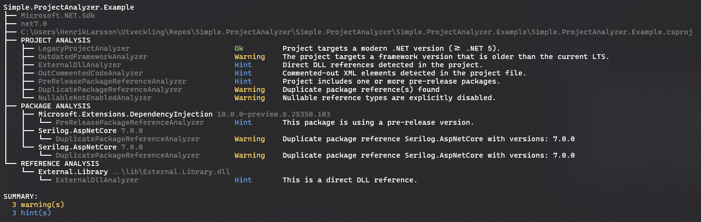
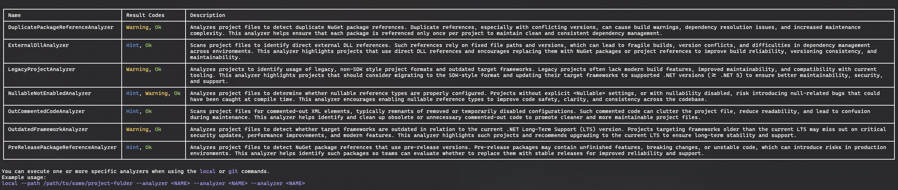

# Simple.ProjectAnalyzer

**Simple.ProjectAnalyzer** is a lightweight static analysis tool for .NET project files (.csproj). It helps teams improve codebase health and maintainability by detecting common issues and inconsistencies across multiple projects in a solution or repository.

## Analyzers

| Name                                    | Targets                    | Codes             | Description                                                                                                                                                                                                                                                                                                                                                                                                                                                    |
|-----------------------------------------|----------------------------|-------------------|:---------------------------------------------------------------------------------------------------------------------------------------------------------------------------------------------------------------------------------------------------------------------------------------------------------------------------------------------------------------------------------------------------------------------------------------------------------------|
| DuplicatePackage<wbr>ReferenceAnalyzer  | Project, PackageReference  | Warning, Ok       | Analyzes project files to detect duplicate NuGet package references. Duplicate references, especially with conflicting versions, can cause build warnings, dependency resolution issues, and increased maintenance complexity.                                                                                                                                                                                                                                 |
| ExternalDll<wbr>Analyzer                | Project, ExternalReference | Hint, Ok          | Scans project files to identify direct external DLL references. Such references rely on fixed file paths and versions, which can lead to fragile builds, version conflicts, and difficulties in dependency management across environments. This analyzer highlights projects that use direct DLL references and encourages replacing them with NuGet packages or project references to improve build reliability, versioning consistency, and maintainability. |
| ImplicitUsings<wbr>Analyzer             | Project                    | Ok, Hint, Warning | Analyzes project files to determine whether <ImplicitUsings> is explicitly defined. Implicit usings provide a set of default using directives depending on the target framework, which can simplify code but may also introduce hidden dependencies. This analyzer helps ensure that the implicit using behavior is intentional and clearly declared in the project file, improving project clarity and reducing ambiguity.                                    |
| LegacyProjectAnalyzer                   | Project                    | Ok, Warning       | Analyzes projects to identify usage of legacy, non-SDK style project formats and outdated target frameworks. Legacy projects often lack modern build features, improved maintainability, and compatibility with current tooling. This analyzer highlights projects that should consider migrating to the SDK-style format and updating their target frameworks to supported .NET versions (>= .NET 5) to ensure better maintainability, security, and support. |
| NullableNotEnabled<wbr>Analyzer         | Project                    | Ok, Warning, Hint | Analyzes project files to determine whether nullable reference types are properly configured. Projects without explicit <Nullable> settings, or with nullability disabled, risk introducing null-related bugs that could have been caught at compile time. This analyzer encourages enabling nullable reference types to improve code safety, clarity, and consistency across the codebase.                                                                    |
| OutCommentedCode<wbr>Analyzer           | Project                    | Ok, Hint          | Scans project files for commented-out XML elements, typically remnants of removed or temporarily disabled configurations. Such commented code can clutter the project file, reduce readability, and lead to confusion during maintenance. This analyzer helps identify and clean up obsolete or unnecessary commented-out code to promote cleaner and more maintainable project files.                                                                         |
| OutdatedFramework<wbr>Analyzer          | Project                    | Ok, Warning       | Analyzes project files to detect whether target frameworks are outdated in relation to the current .NET Long-Term Support (LTS) version. Projects targeting frameworks older than the current LTS may miss out on critical security updates, performance improvements, and modern features. This analyzer highlights such projects and recommends upgrading to the current LTS to ensure long-term stability and support.                                      |
| PreReleasePackage<wbr>ReferenceAnalyzer | Project, PackageReference  | Ok, Hint          | Analyzes project files to detect NuGet package references that use pre-release versions. Pre-release packages may contain unfinished features, breaking changes, or unstable code, which can introduce risks in production environments. This analyzer helps identify such packages so teams can evaluate whether to replace them with stable releases for improved reliability and support.                                                                   |
| TestProjectNaming<wbr>Analyzer          | Project                    | Ok, Hint          | Ensures that test projects follow a consistent naming convention, typically ending with '.Tests'. Consistent naming helps improve discoverability, test filtering, and overall project structure clarity.                                                                                                                                                                                                                                                      |

## State of Now

### Analysis

Example: `git --path https://github.com/henkla/Simple.ProjectAnalyzer.git --verbose`

### Available analyzers

Example: `analyzers --list `

## Todo 
* ~Change name of analyze command to local~
* ~Create new command repo with same settings as command local~
* ~Remove analyzers that are no longer needed~
* ~Make CurrentLtsVersionService actually fetch latest lts from internet~
* PackadeReference class should have field Version be of type Version instead of string
* ~Create a new class responsible for printing result to cli~
* Add --output|-o options to both commands (local and repo) so that output can be written to file (should be jsonc format)
* ~ExternalDllAnalyzer should look att Project object and not csproj-file. All neded for analysis is already parsed~
* ~Add verbose output on all steps in the analysis~
* There appears to be a bug when looking for project files in parent directories

                                                                                                                                                                                              