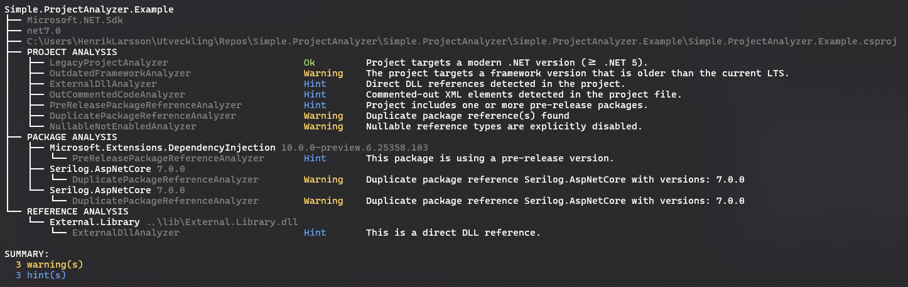

# Simple.ProjectAnalyzer

## State of Now

## Todo 
* ~Change name of analyze command to local~
* ~Create new command repo with same settings as command local~
* ~Remove analyzers that are no longer needed~
* ~Make CurrentLtsVersionService actually fetch latest lts from internet~
* PackadeReference class should have field Version be of type Version instead of string
* ~Create a new class responsible for printing result to cli~
* Add --output|-o options to both commands (local and repo) so that output can be written to file (should be jsonc format)
* ~ExternalDllAnalyzer should look att Project object and not csproj-file. All neded for analysis is already parsed~
* ~Add verbose output on all steps in the analysis~
* There appears to be a bug when looking for project files in parent directories
